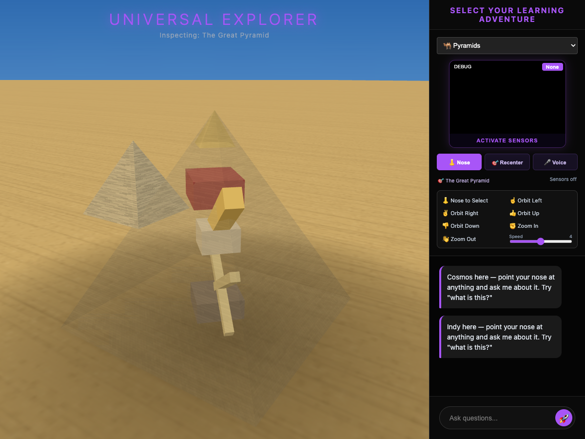
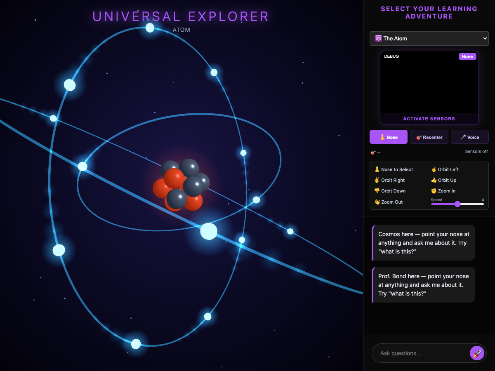
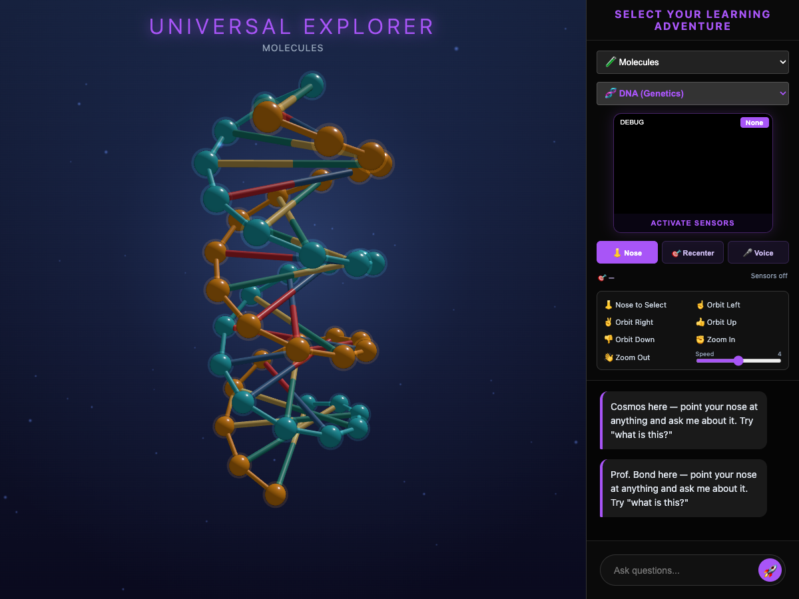
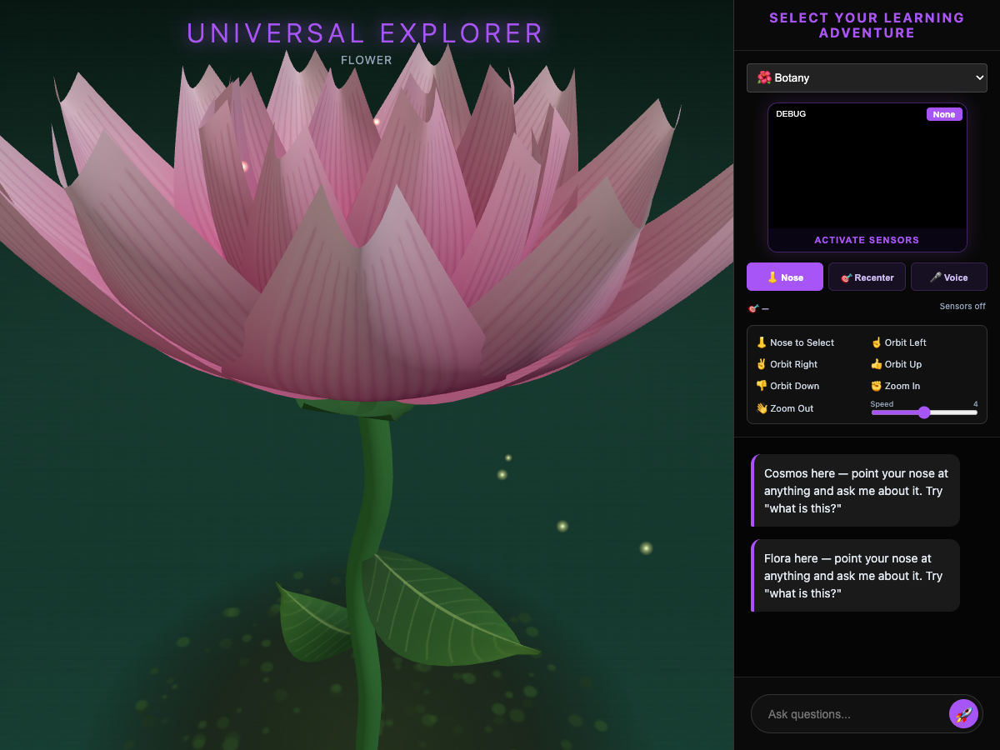
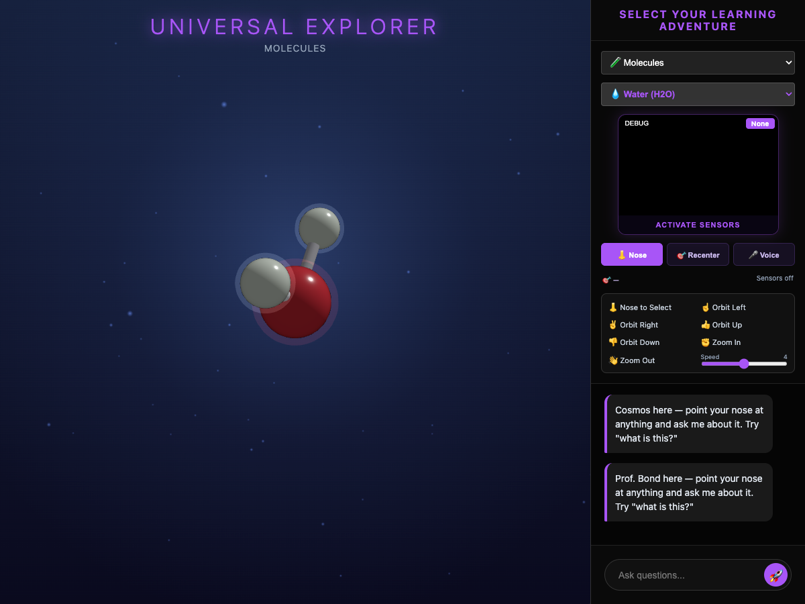

# Universal Life Explorer

A hands-free 3D science universe — planets, molecules, atoms, an Egyptian pyramid, a flower, and a full human-anatomy explorer — steered with your **nose** and **hands**, guided by an **OpenAI Realtime voice** that answers questions, narrates guided tours, and drives the app itself.



## What it does

- **👃 Nose pointer** — your head aims a cursor (MediaPipe FaceLandmarker); hold your gaze ~2s to select. Works on planets AND on organs inside the anatomy module.
- **🖐️ Hand gestures** — one hand orbits and zooms any scene; **two hands grab a planet and rip it open** like an orange — crust and mantle split, strands stretch and snap, the glowing core is exposed.
- **🎙️ Voice guide with function calling** — an OpenAI Realtime session with a persona per world (Cosmos the astronomer, Professor Bond the chemist, Indy the archaeologist, Flora the botanist, Dr. Somatic the anatomist). The voice doesn't just talk — it **operates the app** through seven tools: switch scenes, X-ray the pyramid, fly to objects, run narrated tours, change the atom's element, close views.
- **💬 Typed guide** — a sidebar chat with the same look-target context.
- **🫀 Human Anatomy module** — 25+ procedurally built organs, pose-tracking body mirror, Learn Mode and quiz, embedded untouched as its own app.

## How OpenAI models are used (GPT-5.6 highlighted)

| Model | Where | What it does |
|---|---|---|
| **`gpt-5.6-luna` (GPT-5.6, Responses API)** | `server.py` → `/api/guide`, `/api/ask` | Every typed question in the explorer sidebar and the anatomy tutor is answered by GPT-5.6, grounded in the object the user's nose is pointing at (name + facts context are injected per request). |
| `gpt-realtime-2.1` (Realtime API, WebRTC) | `explorer.html` → `/session` SDP proxy | Live voice conversation with per-scene personas **plus function calling**: `switch_view`, `show_inside`, `focus_object`, `start_tour`, `stop_tour`, `set_element`, `close_view`. Tool results are fed back so the model confirms actions out loud. |
| `gpt-4o-mini-transcribe` | Realtime session config | Input transcription for the voice session. |

The API key never reaches the browser: a ~500-line Python stdlib server (`server.py`) proxies the Responses API and mints the Realtime SDP session.

## Run it

Requirements: Python 3.10+, Chrome, a webcam + microphone.

```bash
# 1) put your key in .env (never committed):
#    OPENAI_API_KEY=sk-...
# 2) start the server
python3 server.py
# 3) open the explorer
open http://localhost:8010/explorer.html
```

Click **ACTIVATE SENSORS**, allow the webcam, and try:

- Point your nose at a planet, hold still — then ask aloud **"what is this?"**
- **"Give me a tour"** — the camera flies stop-to-stop while the persona narrates
- **"Show me what's inside the pyramid"** — the shell X-rays and the King's Chamber, Queen's Chamber, Grand Gallery, and Subterranean Chamber become nose-selectable
- Grab a planet with **both hands and pull apart** to expose its core
- **"Show me iron"** in the Atom view — real electron-shell configurations per element
- Launch **Human Anatomy** and nose-select organs; ask the tutor about them

Everything is vendored (`vendor/` holds the MediaPipe wasm + models), so no CDN is needed at runtime.

## Tech

- **Three.js**, zero build step — two single-file HTML apps (`explorer.html`, `index.html`). Every organ, planet, and texture is procedural: Perlin/fbm noise for brain gyri and intestines, canvas-generated limestone masonry, CPK-accurate molecules, a B-DNA double helix.
- **MediaPipe Tasks** (GestureRecognizer + FaceLandmarker) on the GPU delegate with CPU fallback; One Euro filter, neutral-pose calibration, dead-zoning, and dwell detection for the nose pointer.
- **Performance engineering** — full geometry/material/texture disposal on scene switches (fixed a measured 3× VRAM leak), vision-inference throttling, adaptive pixel ratio, render pausing under the anatomy iframe, idle auto-shutdown for camera and voice.

## Screenshots

| | |
|---|---|
|  |  |
|  |  |
